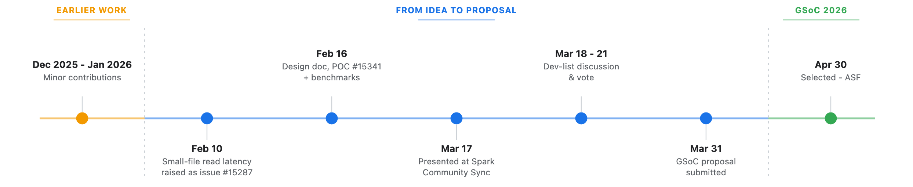
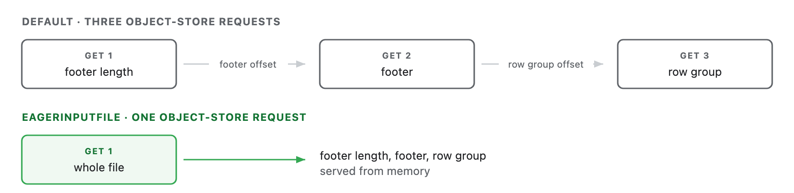
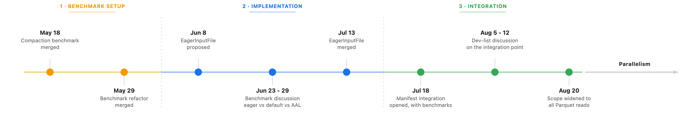
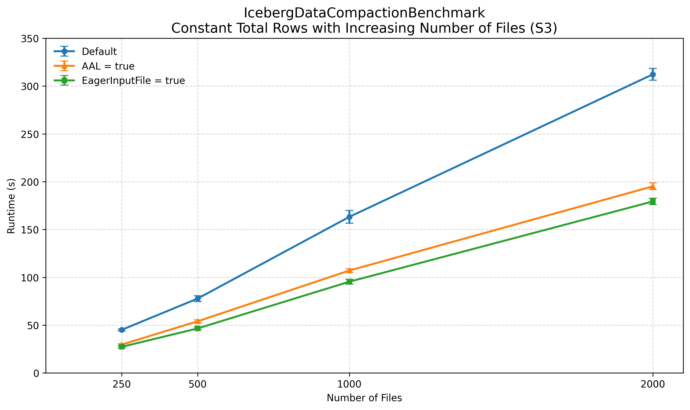

# Improving Iceberg Read Performance

**GSoC 2026 Final Work Product**

<table>
<tr><td><b>Contributor</b></td><td>Varun Lakhyani (<a href="https://github.com/varun-lakhyani">@varun-lakhyani</a>)</td></tr>
<tr><td><b>Organization</b></td><td>Apache Software Foundation — <a href="https://iceberg.apache.org/">Apache Iceberg</a></td></tr>
<tr><td><b>Mentor</b></td><td>Russell Spitzer (<a href="https://github.com/RussellSpitzer">@RussellSpitzer</a>)</td></tr>
</table>

---

## Abstract

Parquet reads in Iceberg issue **at least three separate object-store requests
per file**, each a round trip during which the reader does nothing. For
small-file workloads this overhead dominates scans and compaction, making
performance bound by request count and round-trip latency rather than
throughput. This work addresses that overhead by introducing `EagerInputFile`
and `EagerInputStream` in Iceberg core, which fetch the file eagerly and serve
subsequent reads from memory and works with any `InputFile` implementation.
The approach is being integrated into Iceberg's Parquet read path so Parquet
requests for files within the configured threshold can be served eagerly,
reducing the number of requests and the round trips they cost with parallel
reads across all file sizes as a further step.

## Goals

Improve Iceberg read performance across different workloads and file sizes.

- Optimize small-file Parquet reads by reducing redundant object-store requests across
  data files, V4 manifests, and other Parquet read paths.
- Introduce parallelism in Spark readers to improve read performance regardless of
  file size.

## Background

<table>
<tr><td><b>Proposal references</b></td><td><a href="https://github.com/apache/iceberg/issues/15287">issue #15287</a> &middot; <a href="https://github.com/apache/iceberg/pull/15341">POC #15341</a> &middot; <a href="https://youtu.be/usgUe8r_e9E?t=151">Spark Community Sync</a> &middot; <a href="https://lists.apache.org/thread/rvbwmcbrlr3syd1movflw3vmprm27nmz">Dev-list discussion &amp; vote</a></td></tr>
</table>

## The Fundamental Issue: Three Requests per File

Reading a Parquet file starts at the end and each request locates the next.

When the file is only a few kilobytes, those requests cost more than the data they
carry. Fetching it once and serving all three reads from memory replaces three
round trips with one — that is what `EagerInputFile` does ([#16729](https://github.com/apache/iceberg/pull/16729)),
and it is being wired into the Parquet read path
([#17284](https://github.com/apache/iceberg/pull/17284)).

Parallelism would have hidden this per-file latency rather than removed it so
removing the requests was prioritised first. With the core change merged and
heading into a release work on parallelism is now in progress.

## Contributions

### 1. Benchmark Setup — Merged

Groundwork: benchmark coverage for the compaction and read paths so the later
optimisation could be measured accurately.

| PR | Title | Merged |
| --- | --- | --- |
| [#16219](https://github.com/apache/iceberg/pull/16219) | Spark: Add compaction only benchmark — rewrite data files | May 18, 2026 |
| [#16593](https://github.com/apache/iceberg/pull/16593) | Spark: Compact IcebergSortCompactionBenchmark to use base compaction class | May 29, 2026 |

### 2. EagerInputFile Implementation — Merged

| PR | Title | Merged |
| --- | --- | --- |
| [#16729](https://github.com/apache/iceberg/pull/16729) | Core: Add `EagerInputFile` and `EagerInputStream` to buffer files below a size threshold | Jul 13, 2026 |

Introduced `EagerInputFile` and `EagerInputStream` in Iceberg core: the file is
fetched once up front and every subsequent read is served from memory, removing
redundant object-store requests.

### 3. Integration — Under Review

| PR | Title | Status |
| --- | --- | --- |
| [#17284](https://github.com/apache/iceberg/pull/17284) | Core: Add eager fetch to the Parquet read path | Under review — wires `EagerInputFile` into the Parquet reader |

Integrates `EagerInputFile` into Iceberg's Parquet read path so files below the
configured threshold are fetched eagerly, covering every Parquet read — data
files, V4 manifests and so on.

The PR is currently waiting on a stale Parquet manifest-length fix tracked in
[#16910](https://github.com/apache/iceberg/pull/16910) — not my PR, I am only part
of the discussion.

## Benchmark Results

Measured with **JMH** on an AWS EC2 `r5.4xlarge` in the same region as the S3
bucket.

### Compaction — 20M rows · [Full benchmark report →](https://github.com/varun-lakhyani/iceberg-default-aal-eagerinputfile/blob/main/README.md)

<table align="left" hspace="28">
<tr><th colspan="6" align="left">Runtime (s)</th></tr>
<tr><th align="right">Files</th><th align="right">Default</th><th align="right">AAL</th><th align="right">EagerInputFile</th><th align="right">vs Default</th><th align="right">vs AAL</th></tr>
<tr><td align="right">250</td><td align="right">45.104</td><td align="right">29.671</td><td align="right">27.311</td><td align="right">39.45%</td><td align="right">7.95%</td></tr>
<tr><td align="right">500</td><td align="right">77.788</td><td align="right">54.030</td><td align="right">46.553</td><td align="right">40.15%</td><td align="right">13.84%</td></tr>
<tr><td align="right">1000</td><td align="right">163.238</td><td align="right">107.138</td><td align="right">95.429</td><td align="right">41.54%</td><td align="right">10.93%</td></tr>
<tr><td align="right">2000</td><td align="right">312.252</td><td align="right">195.158</td><td align="right">179.351</td><td align="right">42.56%</td><td align="right">8.10%</td></tr>
</table>

<table align="left">
<tr><th colspan="4" align="left">Requests per file</th></tr>
<tr><th align="left">Config</th><th align="center">GET</th><th align="center">HEAD</th><th align="center">Total</th></tr>
<tr><td>Default</td><td align="center">3</td><td align="center">0</td><td align="center">3</td></tr>
<tr><td>AAL</td><td align="center">1</td><td align="center">1</td><td align="center">2</td></tr>
<tr><td>EagerInputFile</td><td align="center">1</td><td align="center">0</td><td align="center">1</td></tr>
<tr><td colspan="4">Derived from S3 bucket logs</td></tr>
</table>

 

EagerInputFile reduced compaction runtime by 39–43% versus the default path and
8–14% versus the S3 Analytics Accelerator Library (AAL), while reducing requests to
one per file.

### Manifest Reads — V4 Parquet on S3 · [Full benchmark report →](https://github.com/varun-lakhyani/iceberg-manifest-eagerpath-benchmark/blob/main/README.md)

<table align="left" hspace="28">
<tr><th colspan="5" align="left">Runtime (s/op)</th></tr>
<tr><th align="right">Columns</th><th align="center">Partitioned</th><th align="right">Default</th><th align="right">EagerInputFile</th><th align="right">Reduction</th></tr>
<tr><td align="right">10</td><td align="center">Yes</td><td align="right">0.161</td><td align="right">0.094</td><td align="right">41.6%</td></tr>
<tr><td align="right">10</td><td align="center">No</td><td align="right">0.142</td><td align="right">0.100</td><td align="right">29.6%</td></tr>
<tr><td align="right">100</td><td align="center">Yes</td><td align="right">0.134</td><td align="right">0.096</td><td align="right">28.4%</td></tr>
<tr><td align="right">100</td><td align="center">No</td><td align="right">0.138</td><td align="right">0.101</td><td align="right">26.8%</td></tr>
</table>

<table align="left">
<tr><th colspan="3" align="left">GETs per manifest read</th></tr>
<tr><th align="left">Format</th><th align="center">Default</th><th align="center">EagerInputFile</th></tr>
<tr><td>V1–V4 Avro</td><td align="center">1</td><td align="center">1</td></tr>
<tr><td>V4 Parquet</td><td align="center">3</td><td align="center">1</td></tr>
<tr><td colspan="3">Derived from S3 bucket logs</td></tr>
</table>

 

EagerInputFile reduced V4 Parquet manifest read time by 27–42% while reducing
requests from three to one per manifest. Avro shows no measurable difference, as
expected, since it already reads in a single GET.

## What's Left to Do

- **Land [#17284](https://github.com/apache/iceberg/pull/17284)** — waiting on the manifest-length fix in
  [#16910](https://github.com/apache/iceberg/pull/16910).
- **Parallelism** — extending the read path with parallel execution across all
  file sizes.

## Key Learnings

Apart from the technical learnings, working within the Apache Iceberg community
taught me how to take a large, open-ended idea through a community-driven
development process — from identifying the problem and discussing it with the
community, to building a POC, taking feedback, refining the approach, and moving
through implementation, integration, review, and eventually merging. I learned to
break large ideas into smaller steps, use feedback to refine the direction, and let
each step inform the next.

I also developed a stronger **reviewer perspective**. My mentor encouraged me to
review other PRs and walked me through his own review approach during our
discussions. This changed how I approach my own changes: I now think not only about
correctness, but also about how easily another contributor can understand and
review them. This has improved how I structure changes and communicate technical
decisions clearly.

## Community Engagement

- **Community sync** — presented the overall proposal at the
  [Iceberg Spark Community Sync](https://youtu.be/usgUe8r_e9E?t=151) to get feedback on it.
- **Dev mailing list** — active across several threads and ongoing discussions,
  taking feedback and reviews.
- **Pull requests** — [contributing changes](https://github.com/apache/iceberg/pulls?q=author%3Avarun-lakhyani)
  to Iceberg, from benchmarks through to core.
- **Reviews** — getting started with reviewing PRs to help the community, such as
  [#16910](https://github.com/apache/iceberg/pull/16910).

## Links

<table>
<tr><td valign="top"><b>Issues</b></td><td><a href="https://github.com/apache/iceberg/issues/15287">#15287</a> Small-file read latency &middot; <a href="https://github.com/apache/iceberg/issues/16905">#16905</a> Stale manifest length <b>(not mine)</b></td></tr>
<tr><td valign="top"><b>Merged PRs</b></td><td><a href="https://github.com/apache/iceberg/pull/16219">#16219</a> Compaction benchmark &middot; <a href="https://github.com/apache/iceberg/pull/16593">#16593</a> Benchmark refactor &middot; <a href="https://github.com/apache/iceberg/pull/16729">#16729</a> EagerInputFile / EagerInputStream</td></tr>
<tr><td valign="top"><b>Open PRs</b></td><td><a href="https://github.com/apache/iceberg/pull/17284">#17284</a> Parquet read path integration &middot; <a href="https://github.com/apache/iceberg/pull/16910">#16910</a> Manifest-length fix <b>(not mine)</b></td></tr>
<tr><td valign="top"><b>Dev mailing list</b></td><td><a href="https://lists.apache.org/thread/rvbwmcbrlr3syd1movflw3vmprm27nmz">GSoC idea vetting and vote</a> &middot; <a href="https://lists.apache.org/thread/yb8nom3w2zplb703m0p052kcc1wwotrr">EagerInputFile discussion</a> &middot; <a href="https://lists.apache.org/thread/qhn00762nrxl1zmb817wqqq5tzlqolbq">Integration point discussion</a></td></tr>
<tr><td valign="top"><b>Community sync</b></td><td><a href="https://youtu.be/usgUe8r_e9E?t=151">Iceberg Spark Community Sync, 17 Mar 2026</a></td></tr>
<tr><td valign="top"><b>Benchmark reports</b></td><td><a href="https://github.com/varun-lakhyani/iceberg-default-aal-eagerinputfile/blob/main/README.md">Compaction</a> &middot; <a href="https://github.com/varun-lakhyani/iceberg-manifest-eagerpath-benchmark/blob/main/README.md">Manifest reads</a></td></tr>
<tr><td valign="top"><b>POC</b></td><td><a href="https://github.com/apache/iceberg/pull/15341">#15341</a> Async reader</td></tr>
<tr><td valign="top"><b>Earlier contributions</b></td><td><a href="https://github.com/apache/iceberg/pull/14933">#14933</a> &middot; <a href="https://github.com/apache/iceberg/pull/15016">#15016</a> &middot; <a href="https://github.com/apache/iceberg/pull/14981">#14981</a> &middot; <a href="https://github.com/apache/iceberg/pull/15028">#15028</a> &middot; <a href="https://github.com/apache/iceberg/pull/14943">#14943</a></td></tr>
<tr><td valign="top"><b>All contributions</b></td><td><a href="https://github.com/apache/iceberg/pulls?q=author%3Avarun-lakhyani">Every PR I have opened in Iceberg</a></td></tr>
<tr><td valign="top"><b>Proposal</b></td><td><a href="https://drive.google.com/file/d/1uC6AXdwo_REnK8SpPTM1hXgUD0s8Qiss/view?usp=sharing">GSoC 2026 proposal</a></td></tr>
</table>

## Acknowledgements

I am incredibly grateful to my mentor,
[Russell Spitzer](https://github.com/RussellSpitzer), who never let me feel stuck
or without a way forward, and always guided me through every situation.

Thanks to everyone in the Apache Iceberg community who took part in discussions,
shared feedback, and reviewed my changes. There are too many to name individually,
but each conversation, suggestion, and review helped shape this work, and I truly
appreciate all of it.

